# Today I Conceptualized.
[Website](https://stakiran.github.io/tic/) | [GitHub](https://github.com/stakiran/tic)

最新は下にぶら下げるのではなく、上に積み上げていきます。

# Concept as Skeleton
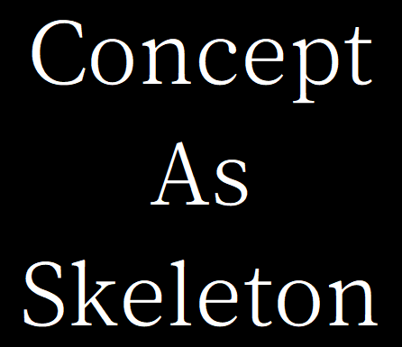

骨格としての概念（Concept as Skeleton）

俺は骨格のつもりで概念を提示している。

骨格ゆえに欠かすことはできない。 
しかし、肉付けは俺の両分ではない。

## Conflict or Cancer
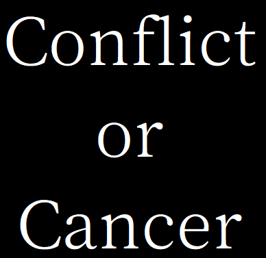

衝突か癌か（Conflict or Cancer）

衝突してでも癌の原因から守れ。

それができねば、蝕まれるだけよ。

## Cognitive Cancer
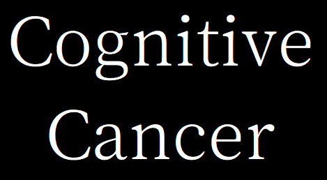

認知的な癌（Cognitive Cancer）

貧乏だと金のことばかり考えるから生産性が落ち、思考力も鍛えられない。 
立場が不安定だと保身のことばかり考えるから、やはり落ちるし、鍛えられない。

癌なんだ。

どちらも存在を認め、根本を取り除かない限りは、解消はおろか軽減さえしない。 
そして取り除くのにも多大な手間と苦痛を伴うのだ。

結局、癌にならないよう自衛するのが一番なのさ。

## Romable
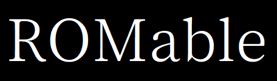

ロメイブル（Romable）

会議の辞退や非同期の導入はたいてい非現実的である。 
ならば、せめて ROM ろう。

つまり、ROM れるかどうかが大事なのである。

## Online Shy

オンライン・シャイ（Online Shy）

シャイばかりで困るよ。 
チャットやノート上でやり取りを続けることすらできないんだぜ？

しないだけだって？ 
いいや、できるならやるんだよ。

やってないってことはできないってことさ。 
単にアンタがシャイなだけなのさ。

## Context Management
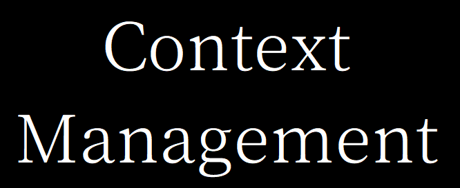

コンテキスト・マネジメント（Context Management）

あまりにも無頓着で、下手くそばかりだ。 
だから会議がなくならないのさ。

コンテキストの管理は、人間にも必要なものなのさ。 
AI による成果物が増えるんだからなおさらだろう？

## Family Diversity
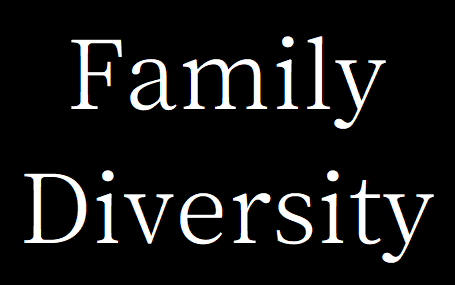

家族の多様性（Family Diversity）

一つのテーブル席は一つの家族にあてるもの。 
俺は一人だが、家族のメンバーが俺一人であるというだけだ。

## Consemony
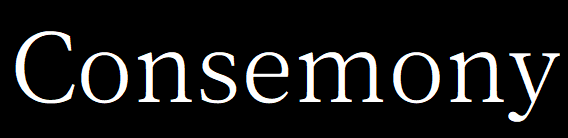

コンセモニー（Consemony）

合意形成主義かつ儀式主義は非常によく見られる。 
もったいぶって、ミーティングの場でのみ合意形成するのである。

非同期もできず、読み書きもできない人達。 
子供のように、予定という名の時間割に従うことしかできない受動的なアダルトチルドレン。

どうすればこの人達を救えるのだろう？

## Communication Cursor
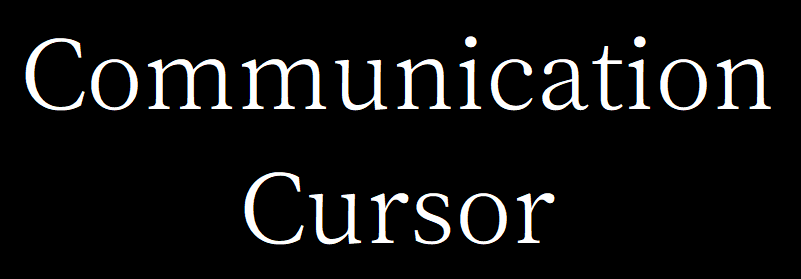

コミュニケーション・カーソル（Communication Cursor）

明示するだけで、驚くほど上手くいく。

私達はなぜか頭で抱えたがり、処理したがるんだよな。

## Beforeffective
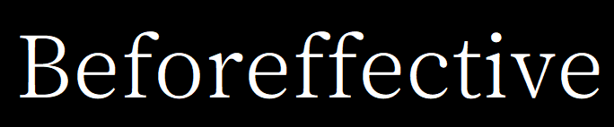

ビフォアフェクティブ（Beforeffective）

有用性（Effectiveness）とは文脈に対して論じるものらしい。 
ゆえに文脈がなければ論じようがなく、その概念は一蹴される。

文脈なんてその場で想定すればいいんだよ。 
だが、読者や提案先にはそれを行うだけのメンタルモデルも、スキルも体力もないのだ。

だから明示的に捉えてやることにした。

## Envisionability
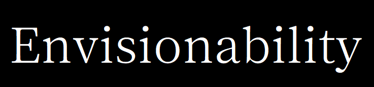

エンビジョナビリティ（Envisionability）

いいか、フィジビリティは層なんだ。

価値の下に文化があり、文化の下に組織がある。 
組織の下に資源があり、資源の下に技術がある。

あるんだよ、その下が。 
技術の下に、概念があるんだ。

その概要を、運用を、光景をイメージせよ。 
イメージできるまで概念をこねて、ぶつけるのさ。

## Soliator
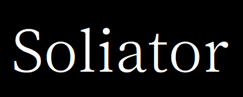

ソリエイター（Soliator）

ターミネーターみたいだ。

実際、そのとおりである。 
人間を捨ててるようなものだから。

ぼく、人間ちゃわ。 
ソリエイターや。

## Solitary Creative
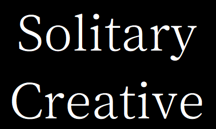

ソリタリー・クリエイティブ（Solitary Creative）

創造と孤独は同義である。

この本質から逃げる者は一生クリエイターにはなれない。 

クリエイターの本質とは価値の提供ではなく自由な探索であり、 
自由を得るための、唯一の手段が、孤独なのである。

## Workstyle Transformation
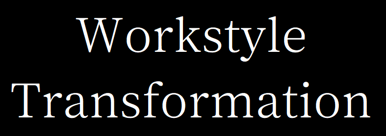

ワークスタイル・トランスフォーメーション（Workstyle Transformation, WX）

人類に真に必要なのは DX（デジタル）でも AX（AI）でもない。

働き方さ。

これほど技術と方法の揃った現代でも毎日出社する？毎日同じ勤務時間に合わせる？ 
おかしいと思わないのか。いいかげん、搾取されていることに気づくべし。 

めんどい、だるい、おかしくね。 
あなたの直感は正しい。変革に向けて、動き出そうではないか。

## Staqueue
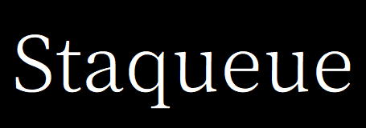

スタッキュー（Stack and Queue, Staqueue）

リストだけじゃないんだよ。

スタックを知っているかい。後に入れたものが先に出てくる。 
キューを知っているかい。先に入れたものが先に出てくる。

コンピュータ向けの、機械的な処理に特化した構造なれど。 
それゆえリストよりも迷いなく使えるのだ。

## Braide
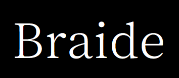

ブレスト・スライド（Brast Slide, Braide）

ブレスト――ブレインストーミングはオズボーンの思惑を超えて、カジュアルに市民権を得た。

しかし、デジタルにおける開拓と定着は道半ばである。 
優秀なクリエイターとマニアックなライターの専売特許に留めるのはもったいなくて、一肌脱いでやった。

スライドだよ。スライド上でブレストするんだ。クラウドに置けば同時編集もできる。 
これでどうだ？君たちの大好きなスライドなんだ、文句なかろう。

## De-Dense
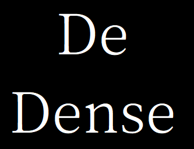

デデンス（De-Dense）

多くの問題は過密から始まる。 
過密とは、たとえば 50% 以上が集まることだ。

ならば、それを回避すればよい。 

50% 以上集まることを禁止する。 
また監視もして、集まったことを契機に、分散策を講じる。

想像してみよ――過密無き世界を。

## Interrupt Designer

割り込みデザイナー（Interrupt Designer）

割り込みは干渉を起こし、干渉は優先順位を変える。 
つまり優先順位は割り込みのデザインによって決まる――いや、決められるのだ。

ならば御そう。 
それを行える者を立ち上げるのだ。

## Cognitive Cosmos
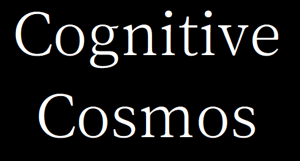

コグモス（Cognitive Cosmos）

認知は宇宙のようだものだと思う。

宇宙空間は苦しい。 
何も無いのは、とっても息苦しいんだ。

だから星を出入りする。

性懲りもなく。 
危険を冒してでも。

## Desk Time
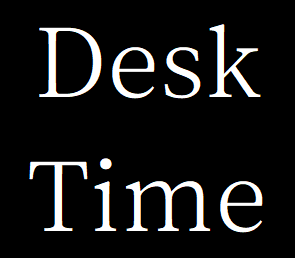

Desk Time

結局のところ、机につく時間を最大化するしかないんだよ。

## weltanschauung
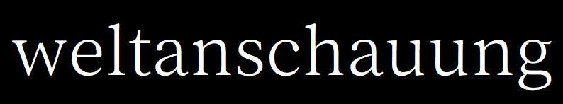

世界観（ヴェルタンシャウン / weltanschauung）

ツールにも、概念にも、世界観というものがある。 
しかし、この概念を表現する言葉が無かった。

幸いなことに、ドイツ語に良さそうなのがあるじゃないか。 
君に決めた。

## 三検
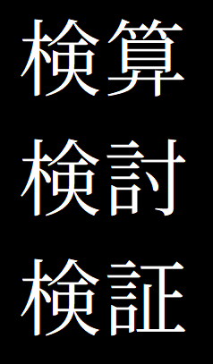

三検（検算、検討、検証）

余裕がないことからすべてが始まる、あるいは終わる。

では余裕とはどうやって手に入れる？

逆に考えよう、余裕があると何ができる？ 
そうしてつくったのが三検だ。

三検をやればいいのさ。 
三検をできるようにすればいいのさ。

## Paved Road
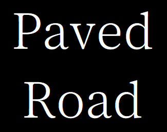

舗装された道路（Paved Road）

権限委譲しなければ先には進めぬ。 
しかしへたくそな奴ばかりだ。

仕方ないな、俺が本質を教えてしんぜよう。

権限委譲とは、整備なのだ。 
お前が整備するんだよ。

道路のように。通れるように。

## Writing Monster
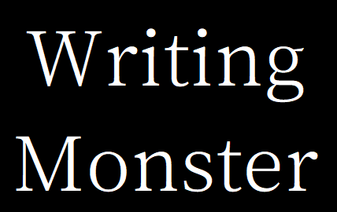

書く怪物（Writing Monster）

俺は書くことが好きだ。 
俺は何者かになるのが好きだ。

ふと、誰かが俺を怪物と言った。 
これは使えると思った。

そうだ、俺は――書く怪物なのだ。

## ADEDR

ソフトウェアエンジニアが開拓する概念は、一般人の役に立つことが多い。

ちょうど俺はヘッドハントされたがっていた。 
そこで三つだけピックアップして、これを啓蒙してやると売り込んだんだ。

- Ajile
- Developer Experience
- Developer Relations

## SAWA
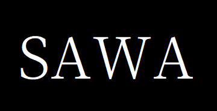

俺のような生物を端的に表現したかった。

- Solitary 孤独
- ASD 自閉症スペクトラム症
- Writing-dominant ライティング優位
- Aphantasia アファンタジア

サワと読む。 
君はサワッてるかい？俺はサワってるよ。

## Today I Conceptualized
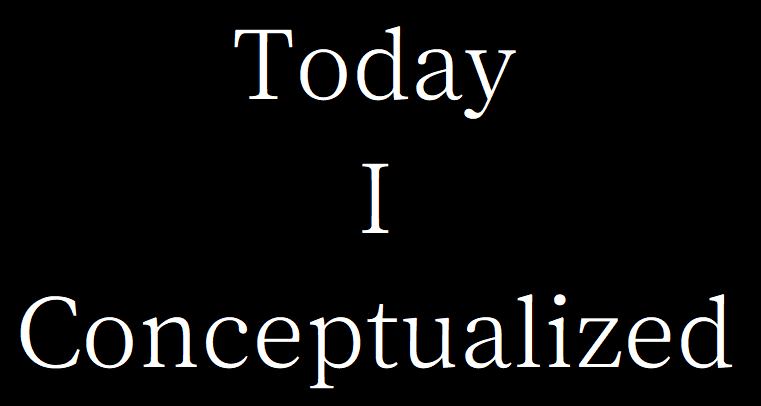

今日概念化したこと（Today I Conceptualized）

[俺](https://scrapbox.io/stao/)は Today I Learned を書いてたことがある。 
今は概念をつくってる。

あるとき、ふと気付いたのだ。 
組み合わせられるんじゃね？と。
