# Today I Conceptualized.
[Website](https://stakiran.github.io/tic/) | [GitHub](https://github.com/stakiran/tic)

- 上ほど最新です
- 実用概念芸術（Practical Conceptual Art）を謳っています
    - 実用的な概念を取り揃えています。思考するのか、行動するのか。お役立てください
    - 提示する概念は枠と土台のみ提供しており、中身はあなた自身が補強します

# 個人サイト管理（Personal Website Management）

個人知識管理（Personal Knowledge Management）だけでは足りぬ。 
VUCA な情報社会から自己を守るには、自分の城が必要だ。

城とは外面の拡張である。 
鍛えられない内面の代わりに造り込み、駆け込んで居座るものだ。

本質的に内密たりえず、公開しなければならない。 
本質的に使い捨てたりえず、抱え続けねばならない。

# 孤独の多様性（Solitude Diversity）
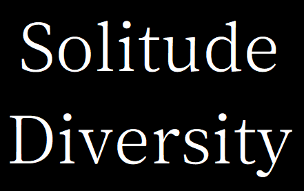

孤独の尊重を効かせたいなら、孤独を求める度合いにグラーデションがあると知れ。

- デフォルト孤独(Default Solitude)
- オンデマンド孤独(On-demand Solitude)
- リアクティブ孤独(Reactive Solitude)

デフォルトで孤独でありたいのか。 
必要なときに必要なだけ孤独でありたいのか。 
それとも一時的にやむを得ないとき以外、自ら取りに行くことはないのか。

# Concept Botany
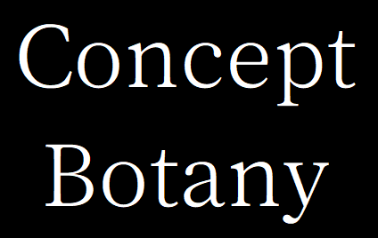

概念には段階がある。植物と同じさ。 
そして、なぜ体系を求めるかもわかるだろう。実がほしいからさ。

- 種: Seed
- 芽: Sprout
- 苗: Seedling
- 木: Tree
- 実: Fruit

# モノトロピスト（Monotropist）
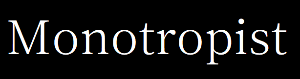

広く薄くか、狭く深くか。 
注意の配り方にもグラデーションがあるのさ。

前者は後者もできるが、後者は前者ができない。 
この非対称性ゆえに、後者は苦しめられる。

だから示そう。後者を指す言葉を。

幸いにもモノトロピズム（Monotropism）がある。 
ならば名乗ればいいだけさ。

# 四余
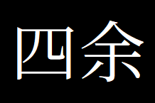

- 余地: 可能性の空き
- 余裕: 資源的な空き
- 余白: 空間的な空き
- 余暇: 時間的な空き

「空き」の解像度を上げて、具体的に把握せよ。

さもなくば空けることは叶わぬ。

# パースペクティブ（Perspective）
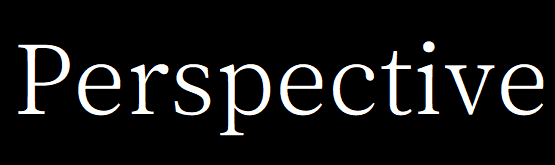

Product → Prototype → Perspective。

提出物の第三潮流は概念、もっというと見方なのだ。

# こえしろ
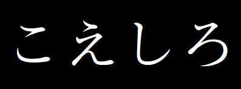

からまりしろを唱えた建築家がいるらしい。

俺から言わせれば傲慢だ。

パルクールを見よ。トレイサーを見よ。 
逸脱を決めるのは設計者ではなく、環境を生きる者なのだ。

# 個人的作業記憶(Personal Working Memory)
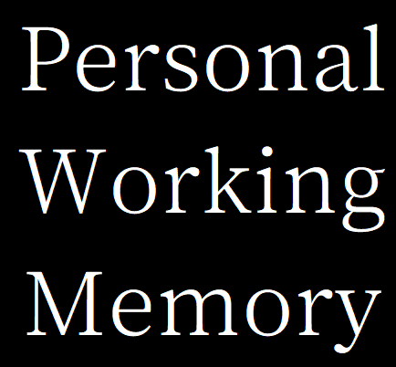

ナレッジとメモを履き違えるな。

ナレッジは長期記憶、メモは短期記憶だ。 
したがって、メモを [PKM](pkm.md) で管理すること自体が筋違いである。

実は新しいジャンルになる。 
ありふれているが、名前すらついてない営みはよくあること。

そこに秀逸な名前を当てて捉えるのが俺の仕事さ。

# フルコンテキスト（Full Context）
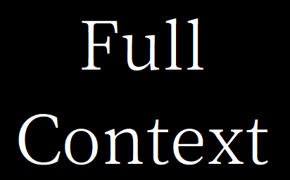

全工程をひとりで回せることをフルスタックと呼ぶ。 
フルスタック・エンジニアがもてはやされる時代が来ていた。

しかし生成 AI により、AI につくらせることが可能となった。

この時代に、真に必要なのは、文脈（コンテキスト）の横断と継承なのだ。

# ジェブログ（Generative weblog, Geblog）
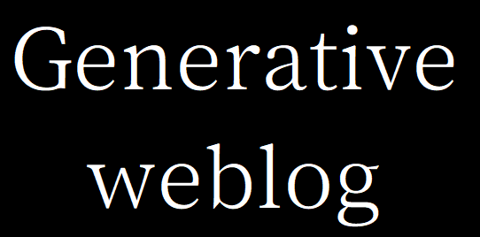

ブログの次は、生成 AI につくらせた記事だろう。 
無論、AI Slop という意味ではない。

生成 AI につくらせた記事の面白さは問いと流れにある。 
問い方と流れ方に個性が現れる。

# リキッドウェア（Liquidware）
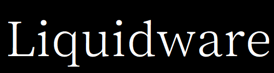

ハードウェア、ソフトウェアの次は概念だ。

# ラクター（RACTR）

俺は運動体系をつくるのが好きだ。 
単に何を大切にすればいいかを整理しただけだ。

- Rhythmical: リズミカルに動かすこと
- Alternately: 交互に動かすこと
- Continuously: 瞬発的でないこと。たとえば1分以上続けられること
- Toolless: 道具を使わないこと
- Repeatly: 同じ動作を反復すること

# メンテナンサー（Maintenancer）
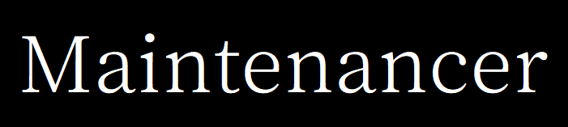

Wiki や博物館のような収集癖整理癖の持ち主がいる。

個人でやる分には問題ないさ。 
ただ一点だけ。

コミュニティには持ち込むな。

収集と整理の押し付けは、トロールにも等しい営みなのだ。 
メンテナではない、まがいものさ。

# 実用概念芸術（Practical Conceptual Art）
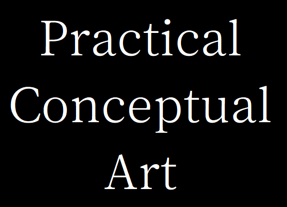

そろそろ俺の営みに名前をつけておく。

実はコンセプチュアル・アートの一種だ。 
実用的な概念をつくっているのである。

つまり、実際に使うことができる。

# 概念的羅針盤（Conceptual Compass）
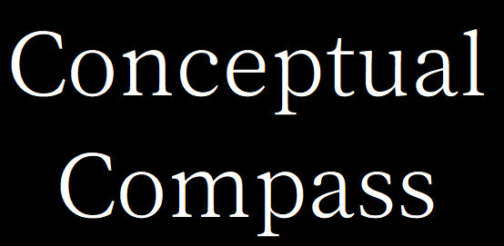

直観や肌感覚は AI 利活用においても有効だ。 

棋士が直観の一手を検証するように。 
ナレッジワーカーもまた、AI を使って検証しているのだ。

# 台本的（Scripty）
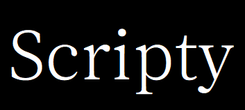

再現性と尊厳はトレードオフだ。 

尊厳が欲しければ。 
尊厳を取り戻したければ。

アドリブに身を投げろ。台本なんて書くな。

# Target As Color
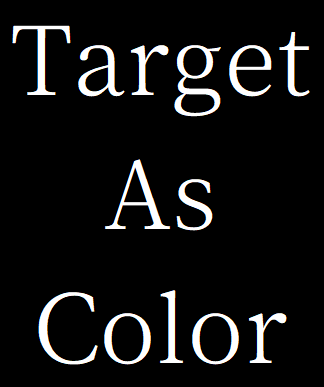

会社のカラーは、高給取りが何を相手にしているかでわかる。

# 観戦者向け翻訳（Spectranslation）
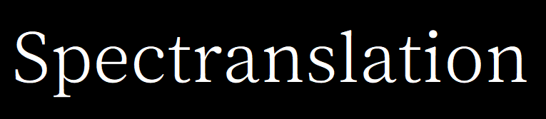

eスポーツと知的スポーツを含むスポーツ観戦は経験者とオタクの娯楽だ。 
その域を越えられないのは、未経験者が理解できないからだ。

ならば理解可能な翻訳をすれば良い。

状況を、葛藤を、難易度を、わかるように翻訳しろ。 
非言語（ノンバーバル）と可視化（ビジュアライゼーション）も駆使せよ。

# デコミュニケーション（De-Communication）
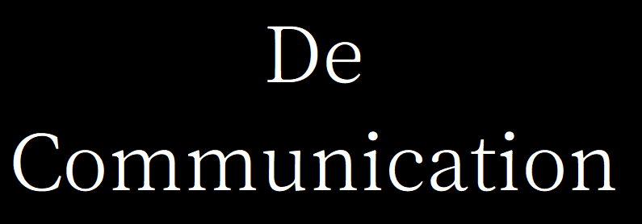

コミュニケーションの本質は、push 的なやりとりだということ。 
相手を指定して、直接渡す。

だから拘束や遠慮が発生する。 
30 の議題を扱うことなどできないだろう？

原始的で前時代的な、このボトルネックを越えたくば。 
コミュニケーションそのものをやめよ。

# 流用主義（Reuseism）

仕事が楽しくないのは、主体性が無いからだ。

資料を流用してつくるのも。 
AI の要約をそのまま共有するのも。

どちらもツギハギと責任転嫁でしかない。主体性がない。 
楽なだけさ。

# 会議ニケーション
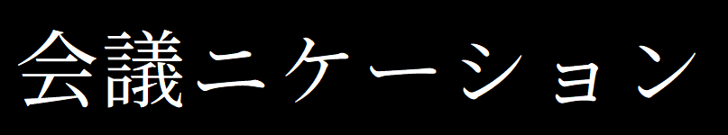

俺に言わせれば、飲みニケーションも会議ニケーションも同じ穴の狢さ。

# 概念的鳶職（Conceptual Scaffolder）
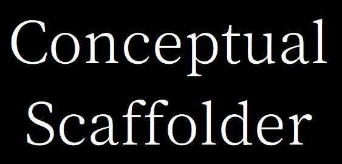

概念は足場であり、私はそれを使って仕上げていく鳶職と言える。

足場を行き来する勇気。 
使い捨てる勇気――。

そう、必要なのは勇気なのだ。

概念を扱う者こそ、勇気が必要なのである。

# エージェントとしての人間（Human as Agent）
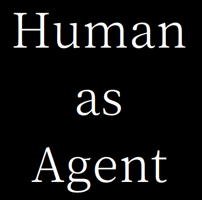

コミュニケーションもチームワークも極めて高度な営みだ。

できなくてもおかしくはない。 
無理やりやらせても何も良いことはない。

幸いにも AI のおかげで、割り切った付き合い方を覚えたはず。 
それを人間に対しても適用するだけさ。

# 骨格としての概念（Concept as Skeleton）
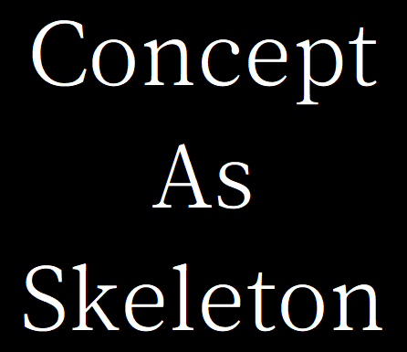

俺は骨格のつもりで概念を提示している。

骨格ゆえに欠かすことはできない。 
しかし、肉付けは俺の両分ではない。

# 衝突か癌か（Conflict or Cancer）
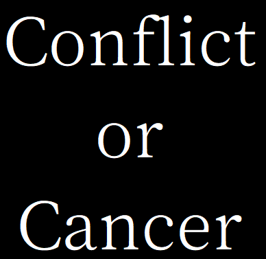

衝突してでも守れ。

できねば蝕まれるだけよ。

# 認知的な癌（Cognitive Cancer）
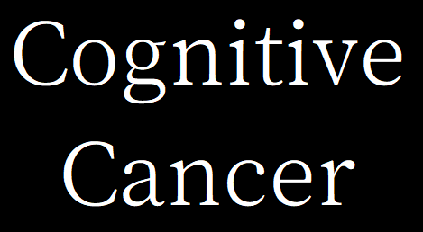

貧乏だと金のことばかり考えるから生産性が落ち、思考力も鍛えられない。 
立場が不安定だと保身のことばかり考えるから、やはり落ちるし、鍛えられない。

癌なんだ。

どちらも存在を認め、根本を取り除かない限りは、解消はおろか軽減さえしない。 
そして取り除くのにも多大な手間と苦痛を伴うのだ。

結局、癌にならないよう自衛するのが一番なのさ。

# ロメイブル（Romable）
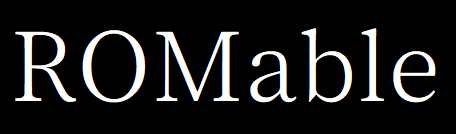

会議の辞退や非同期の導入はたいてい非現実的である。 
ならば、せめて ROM ろう。

つまり ROM れるかどうかが大事なのである。

# オンライン・シャイ（Online Shy）

シャイばかりで困るよ。 
チャットやノート上でやり取りを続けることすらできないんだぜ？

しないだけだって？ 
いいや、できるならやるんだよ。

やってないってことはできないってことさ。 
単にアンタがシャイなだけなのさ。

認めなさい。あなたがシャイなだけなのです。

# コンテキスト・マネジメント（Context Management）
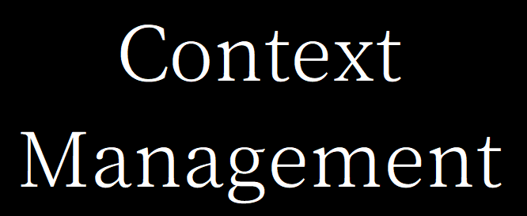

あまりにも無頓着で、下手くそばかりだ。 
だから会議がなくならないのさ。

コンテキストの管理は、人間にも必要なものなのさ。 
AI による成果物が増えるんだからなおさらだろう？

# 家族の多様性（Family Diversity）
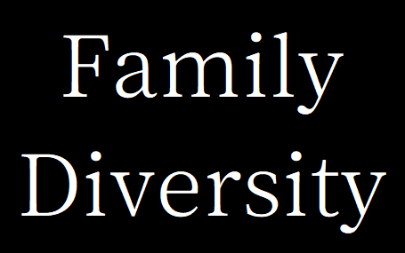

一つのテーブル席は一つの家族にあてるもの。 
俺は一人だが、家族のメンバーが俺一人であるというだけだ。

# コンセモニー（Consemony）
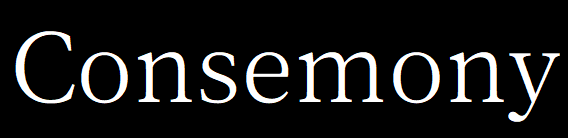

合意形成主義かつ儀式主義は非常によく見られる。 
もったいぶって、ミーティングの場でのみ合意形成するのである。

非同期もできず、読み書きもできない人達。 
子供のように、予定という名の時間割に従うことしかできない受動的なアダルトチルドレン。

どうすればこの人達を救えるのだろう？

# コミュニケーション・カーソル（Communication Cursor）
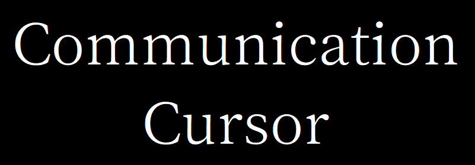

明示するだけで、驚くほど上手くいく。

私達はなぜか頭で抱えたがり、処理したがるんだよな。

# ビフォアフェクティブ（Beforeffective）
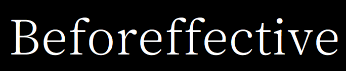

有用性（Effectiveness）とは文脈に対して論じるものらしい。 
ゆえに文脈がなければ論じようがなく、その概念は一蹴される。

文脈なんてその場で想定すればいいんだよ。 
だが、読者や提案先にはそれを行うだけのメンタルモデルも、スキルも体力もないのだ。

だから明示的に捉えてやることにした。

# エンビジョナビリティ（Envisionability）
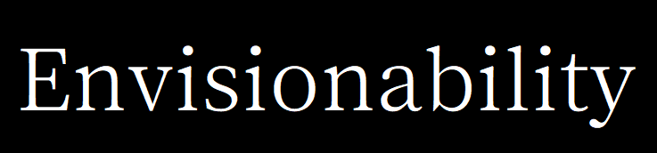

いいか、フィジビリティは層なんだ。

価値の下に文化があり、文化の下に組織がある。 
組織の下に資源があり、資源の下に技術がある。

あるんだよ、その下が。 
技術の下に、概念があるんだ。

その概要を、運用を、光景をイメージせよ。 
イメージできるまで概念をこねて、ぶつけるのさ。

# ソリエイター（Soliator）
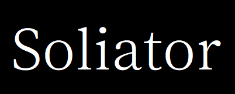

ターミネーターみたいだ。

実際、そのとおりである。 
人間を捨ててるようなものだから。

ぼく、人間ちゃわ。 
ソリエイターや。

# ソリタリー・クリエイティブ（Solitary Creative）
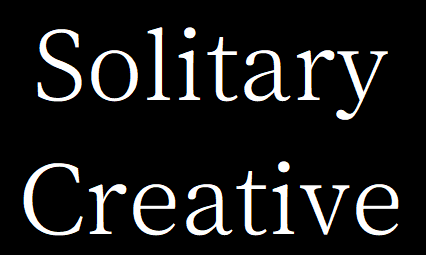

創造と孤独は同義である。

この本質から逃げる者は一生クリエイターにはなれない。 

クリエイターの本質とは価値の提供ではなく自由な探索であり、 
自由を得るための、唯一の手段が、孤独なのである。

# ワークスタイル・トランスフォーメーション（Workstyle Transformation, WX）
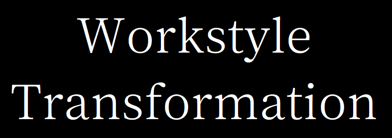

人類に真に必要なのは DX（デジタル）でも AX（AI）でもない。

働き方さ。

これほど技術と方法の揃った現代でも毎日出社する？毎日同じ勤務時間に合わせる？ 
おかしいと思わないのか。いいかげん、搾取されていることに気づくべし。 

めんどい、だるい、おかしくね。 
あなたの直感は正しい。変革に向けて、動き出そうではないか。

# スタッキュー（Stack and Queue, Staqueue）
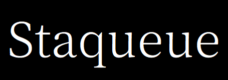

リストだけじゃないんだよ。

スタックを知っているかい。後に入れたものが先に出てくる。 
キューを知っているかい。先に入れたものが先に出てくる。

コンピュータ向けの、機械的な処理に特化した構造なれど。 
それゆえリストよりも迷いなく使えるのだ。

# ブレスト・スライド（Brast Slide, Braide）
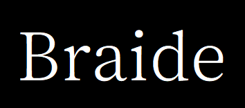

ブレスト――ブレインストーミングはオズボーンの思惑を超えて、カジュアルに市民権を得た。

しかし、デジタルにおける開拓と定着は道半ばである。 
優秀なクリエイターとマニアックなライターの専売特許に留めるのはもったいなくて、一肌脱いでやった。

スライドだよ。スライド上でブレストするんだ。クラウドに置けば同時編集もできる。 
これでどうだ？君たちの大好きなスライドなんだ、文句なかろう。

# デデンス（De-Dense）
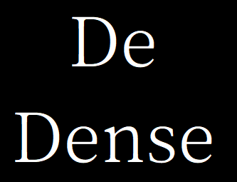

多くの問題は過密から始まる。 
過密とは、たとえば 50% 以上が集まることだ。

ならば、回避すればよい。 

50% 以上集まることを禁止する。 
また監視もして、集まったことを契機に、分散策を講じる。

想像してみよ――過密無き世界を。

# 割り込みデザイナー（Interrupt Designer）
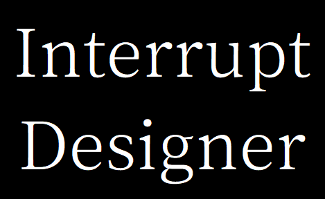

割り込みは干渉を起こし、干渉は優先順位を変える。 
つまり優先順位は割り込みのデザインによって決まる――いや、決められるのだ。

ならば御そう。 
それを行える者を立ち上げるのだ。

# コグモス（Cognitive Cosmos）
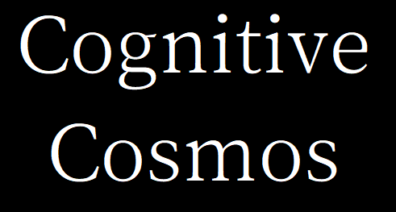

認知は宇宙のようだものだと思う。

宇宙空間は苦しい。 
何も無いのは、とっても息苦しいんだ。

だから星に出入りする。

性懲りもなく。 
危険を冒してでも。

# Desk Time
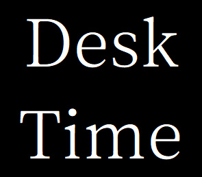

結局のところ、机につく時間を最大化するしかないんだよ。

# 世界観（ヴェルタンシャウン / weltanschauung）
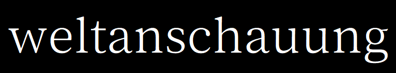

ツールにも、概念にも、世界観というものがある。 
しかし、この概念を表現する言葉が無かった。

幸いなことに、ドイツ語に良さそうなのがあるじゃないか。 
君に決めた。

# 三検（検算、検討、検証）
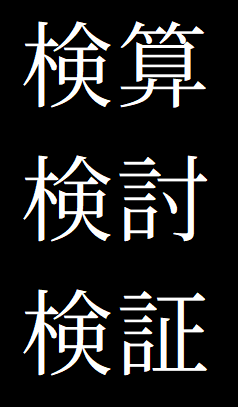

余裕がないことからすべてが始まる、あるいは終わる。

では余裕とはどうやって手に入れる？

逆に考えよう、余裕があると何ができる？ 
そうしてつくったのが三検だ。

三検をやればいいのさ。 
三検をできるようにすればいいのさ。

# 舗装された道路（Paved Road）
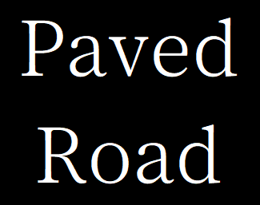

権限委譲しなければ先には進めぬ。 
しかしへたくそな奴ばかりだ。

仕方ないな、俺が本質を教えてしんぜよう。

権限委譲とは、整備なのだ。 
お前が整備するんだよ。

道路のように。通れるように。

# 書く怪物（Writing Monster）
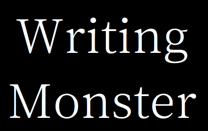

俺は書くことが好きだ。 
俺は何者かになるのが好きだ。

ふと、誰かが俺を怪物と言った。 
これは使えると思った。

そうだ、俺は――書く怪物なのだ。

# ADEDR
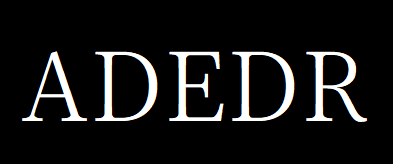

ソフトウェアエンジニアが開拓する概念は、一般人の役に立つことが多い。

ちょうど俺はヘッドハントされたがっていた。 
そこで三つだけピックアップして、これを啓蒙してやると売り込んだんだ。

- Ajile
- Developer Experience
- Developer Relations

# SAWA
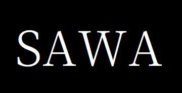

俺のような生物を端的に表現したかった。

- Solitary 孤独
- ASD 自閉症スペクトラム症
- Writing-dominant ライティング優位
- Aphantasia アファンタジア

サワと読む。 
君はサワッてるかい？俺はサワってるよ。

# 今日概念化したこと（Today I Conceptualized）
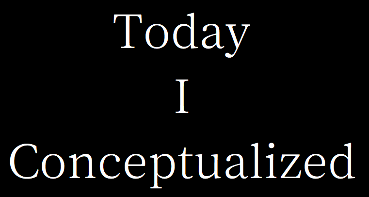

[俺](https://scrapbox.io/stao/)は Today I Learned を書いてたことがある。 
今は概念をつくってる。

あるとき、ふと気付いたのだ。 
組み合わせられるんじゃね？と。
